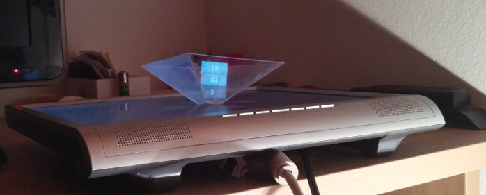
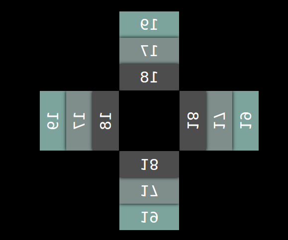

# HoloWeb - Holograms go online

This project aims to bring Holograms online: __Easy to use for everyone__ + __developer-friendly__.

A user should be able to display a hologram application on every device - be it a smartphone, a tablet, a laptop, an office pc or even a Raspberry PI. The only thing needed is a webbrowser - even watches run browsers nowadays.

For a better impressione, have a look at those images!

__Live HoloWeb:__




__Meanwhile on the display:__




## How to use the Web of Holograms
1. You need a pyramide which consists of a semi-transparent material, e.g. plexiglass.
You can easily make one yourself or buy one in the internet. Here's a link to a good DIY tutorial:
https://diyhacking.com/diy-hologram/

2. A device with an installed browser and a display. To interact with it, a mouse and a keyboard need to be connected to the device.

3. A HoloWeb-App you want to run on that device. Have a look at the Example part!

## Developer's guide
You are a developer and want to develope the __HoloWeb-Apps of tomorrow__? Then keep on reading.

### Requirements
- You should be keen on Javascript
- You should know how to use at least one package manager to consume the HoloWeb-packages (e.g. npm, yarn)
- You should have a great idea you want to share with the rest of the world

__This sounds like you?__ Then don't hesitate to open up your console and build something great!

Of course, you also need one of those fancy pyramides!

### Getting started

1. Install the package with the package mananger of your choice!
For Example:
```bash
npm i -S holoweb
```

2. Consume it somehow (module bundler...).

3. Build great applications! (Have a look at the documentation part)

### Documentation

Here's a list of all exports of the module and how to use them. Sorted by importance.

1. __setMarkup()__

  ```javascript
  setMarkup(html: String, element: DOMElement)
  ```

  This function created a hologram out of your DOM-Element. Just provide some html content, which you pass as the 1° argument and a DOM-Element.

  _Example_
  ```javascript
  setMarkup(
    `
      <div class="app-container">
        HELLO WORLD
      </div>
    `
  , document.querySelector('#app'));
  ```

  Together with template strings, this can be used very efficiently.

2. __setSize()__

  ```javascript
  setMarkup(width: Number, height: Number)
  ```

  This function resizes the hologram. I think there's not mucsetMarkup(width: Number, height: Number)h more to say.

3. __on()__

  ```javascript
  on(event: String, callback: Function)
  ```

  With this function you can setup event listeners to certain holoweb-events. Here's a list of events (this are constants which are also exported by the module, which can then be used as the first argument of the _on_-method).

  - UP: Fired when the UP-Arrow of the keyboard is hit.
  - DOWN: Fired when the DOWN-Arrow of the keyboard is hit.
  - LEFT: Fired when the LEFT-Arrow of the keyboard is hit.
  - RIGHT: Fired when the RIGHT-Arrow of the keyboard is hit.
  - PRIMARY_ACTION: Fired when the SPACEBAR of the keyboard is hit.
  - SECONDARY_ACTION: Fired when the ENTER-Button of the keyboard is hit.

### Implementation for other frameworks/libraries
Currently, their are no other implementations available. But you are free to write one, if you want (I currently don't have enough time, but if there's more interest in this module, I'm going to write a React-implementation).

## Example
I developed an example app for the HoloWeb. It's a simple clock and not fully finished, I will finish it when I have time for it. But it's good enough to demonstrate this module for now :smile:

It's hosted on Github pages:
